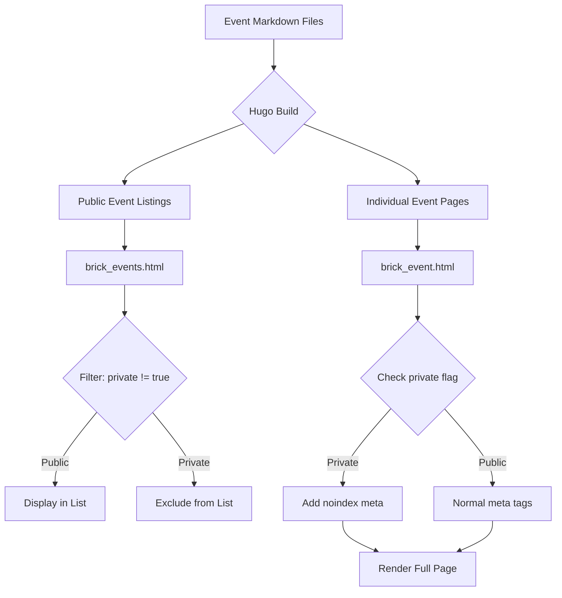

# Design Document: Private Events Feature

## Overview

The private events feature enables event organizers to create cleanup events that are accessible via direct URL but excluded from public listings on the waterwaycleanups.org website. This design addresses privacy requirements for specific groups (scouts, young kids, organizations) while maintaining full RSVP functionality.

The implementation leverages Hugo's built-in filtering capabilities and template conditionals to selectively exclude events from public displays while preserving direct URL access. The solution is minimal, backward-compatible, and requires no changes to existing public events.

### Key Design Principles

1. **Minimal Invasiveness**: Single boolean flag in front matter controls privacy
2. **Backward Compatibility**: Events without the flag remain public by default
3. **Consistent Functionality**: Private events retain all features (RSVP, images, content)
4. **SEO Protection**: Private events include noindex/nofollow directives
5. **Template-Based Filtering**: Hugo's where clause handles exclusion logic

## Architecture

### Hugo Template System

The waterwaycleanups.org site uses Hugo's static site generator with the Hugobricks theme. Events are:
- Stored as markdown files in `content/en/events/` and `content/en/events-archive/`
- Rendered using layouts in `layouts/events/` and partials in `layouts/partials/`
- Listed via the `brick_events` shortcode which calls `layouts/partials/brick_events.html`
- Displayed individually via `layouts/events/single.html` which calls `layouts/partials/brick_event.html`

### Privacy Control Flow

```
Event Markdown File (with private: true)
         |
         v
Hugo Build Process
         |
         +---> Event Listing (brick_events.html)
         |     - Filters out private events
         |     - Only shows public events
         |
         +---> Individual Event Page (brick_event.html)
               - Renders normally
               - Adds noindex/nofollow meta tags
               - Maintains full functionality
```

### Component Interaction



## Components and Interfaces

### 1. Front Matter Schema

**Location**: Event markdown files (`content/en/events/*.md`, `content/en/events-archive/*.md`)

**New Field**:
```yaml
private: true  # Optional boolean, defaults to false if omitted
```

**Example Private Event**:
```yaml
---
title: "Scout Troop 123 Private Cleanup"
private: true
start_time: "2026-03-15T09:00:00-05:00"
end_time: "2026-03-15T12:00:00-05:00"
tags:
  - potomac-river
---
```

### 2. Event Listing Filter

**File**: `layouts/partials/brick_events.html`

**Current Logic**:
```go
{{- $events := where page.Site.RegularPages "Section" "events" -}}
{{- $current_time := now.Format "2006-01-02T15:04:05-07:00" }}
{{- $upcoming_events := where $events "Params.start_time" "ge" $current_time }}
```

**Modified Logic**:
```go
{{- $events := where page.Site.RegularPages "Section" "events" -}}
{{- $public_events := where $events "Params.private" "!=" true -}}
{{- $current_time := now.Format "2006-01-02T15:04:05-07:00" }}
{{- $upcoming_events := where $public_events "Params.start_time" "ge" $current_time }}
```

**Impact**: Filters out any event with `private: true` before time-based filtering and sorting.

### 3. Individual Event Page

**File**: `layouts/partials/brick_event.html`

**Current Behavior**: Renders event page with breadcrumbs, title, image, and content.

**Modified Behavior**: No changes needed to rendering logic. The page continues to render normally for private events.

### 4. SEO Meta Tags

**File**: `layouts/_default/baseof.html` (head section)

**New Conditional Logic**:
```html
{{ if .Params.private }}
<meta name="robots" content="noindex, nofollow">
{{ end }}
```

**Placement**: After existing meta tags, before canonical link.

### 5. Tag Filtering

**File**: `layouts/partials/brick_events.html` (filter section)

**Current Behavior**: Generates filter dropdown from all event tags.

**Modified Behavior**: Generate filter options only from public events.

```go
{{- $public_events := where $events "Params.private" "!=" true -}}
{{- $public_tags := slice -}}
{{- range $public_events -}}
  {{- range .Params.tags -}}
    {{- $public_tags = $public_tags | append . -}}
  {{- end -}}
{{- end -}}
{{- $unique_tags := $public_tags | uniq -}}
```

### 6. Archive Compatibility

**Files**: Same filtering logic applies to archived events in `content/en/events-archive/`

**Behavior**: Private events moved to archive maintain their private status and remain excluded from archive listings.

## Data Models

### Event Front Matter Schema

```yaml
# Required fields (existing)
title: string
start_time: datetime (ISO 8601 format)
end_time: datetime (ISO 8601 format)

# Optional fields (existing)
seo:
  description: string
image: string (path to image)
tags: array<string>
preheader_is_light: boolean

# New optional field
private: boolean  # Default: false (public event)
```

### Hugo Page Variables

**Accessed in Templates**:
- `.Params.private` - Boolean indicating private status
- `.Params.start_time` - Event start time for filtering
- `.Params.tags` - Array of tags for filtering
- `.RelPermalink` - URL path for the event page
- `.Section` - Content section ("events" or "events-archive")

## Correctness Properties

*A property is a characteristic or behavior that should hold true across all valid executions of a system—essentially, a formal statement about what the system should do. Properties serve as the bridge between human-readable specifications and machine-verifiable correctness guarantees.*

Before defining the correctness properties, I need to analyze the acceptance criteria for testability.


### Property 1: Front Matter Privacy Recognition

*For any* event markdown file, when it includes `private: true` in the front matter, Hugo SHALL parse and recognize it as a private event, and when it includes `private: false` or omits the field, Hugo SHALL recognize it as a public event.

**Validates: Requirements 1.1, 1.2**

### Property 2: Direct URL Accessibility

*For any* private event, the generated static site SHALL include a complete HTML page at the event's permalink that returns HTTP 200 status and contains all event content.

**Validates: Requirements 1.3, 3.1, 7.3**

### Property 3: Backward Compatibility

*For any* existing event file without the `private` field in its front matter, the Hugo build SHALL treat it as a public event and include it in all public listings without requiring file modifications.

**Validates: Requirements 1.4, 8.3**

### Property 4: Listing Exclusion

*For any* event listing component (current events or archived events), the rendered HTML SHALL exclude all events where `private: true` and include only events where `private` is false or omitted.

**Validates: Requirements 2.1, 2.2, 7.2**

### Property 5: Tag Filter Exclusion

*For any* tag filter applied to event listings, the filtered results SHALL contain only public events that match the tag, excluding all private events even if they have matching tags.

**Validates: Requirements 2.3**

### Property 6: Complete Page Rendering

*For any* private event page, the rendered HTML SHALL include all standard event components present in public event pages (title, date, image, location, description, RSVP form if specified).

**Validates: Requirements 3.2, 3.3**

### Property 7: URL Structure Consistency

*For any* event (private or public), the generated permalink SHALL follow the same URL structure pattern based on the file path, independent of the private status.

**Validates: Requirements 3.4**

### Property 8: RSVP Functionality Parity

*For any* event with the `event_rsvp` shortcode, the RSVP form behavior SHALL be identical regardless of whether the event is private or public.

**Validates: Requirements 4.1**

### Property 9: RSVP Identifier Format

*For any* event (private or public), the event identifier used by the RSVP system SHALL follow the same format and generation logic.

**Validates: Requirements 4.2**

### Property 10: RSVP Attendance Cap Enforcement

*For any* event with an `attendance_cap` parameter, the RSVP system SHALL enforce the cap identically for both private and public events.

**Validates: Requirements 4.3**

### Property 11: RSVP Notification Behavior

*For any* RSVP submission to an event, the notification system SHALL send the same notifications regardless of whether the event is private or public.

**Validates: Requirements 4.4**

### Property 12: SEO Meta Tag Differentiation

*For any* private event page, the HTML head SHALL include `<meta name="robots" content="noindex, nofollow">`, and for any public event page, the HTML head SHALL NOT include this meta tag.

**Validates: Requirements 5.1, 5.2, 5.4**

### Property 13: Navigation Element Consistency

*For any* private event page, the rendered HTML SHALL include the same header, footer, and breadcrumb navigation elements as public event pages.

**Validates: Requirements 6.1, 6.2, 6.3**

### Property 14: No Revealing Links

*For any* private event page, the breadcrumb navigation SHALL NOT include a link to the public events listing page (`/events/`) that would reveal the event's existence in a public context.

**Validates: Requirements 6.4**

### Property 15: Archive Location Independence

*For any* event with `private: true`, moving the file from `content/en/events/` to `content/en/events-archive/` SHALL maintain its private status and exclusion from listings.

**Validates: Requirements 7.1**

### Property 16: Default Public Behavior

*For any* event file that does not include the `private` field in its front matter, Hugo SHALL treat it as a public event by default.

**Validates: Requirements 8.1, 8.2**

### Property 17: Build Success with Mixed Events

*For any* combination of private and public event files in the content directories, the Hugo build process SHALL complete successfully without errors.

**Validates: Requirements 8.4**

## Error Handling

### Invalid Front Matter Values

**Scenario**: Event file contains `private: "yes"` (string instead of boolean)

**Handling**: Hugo's YAML parser will treat non-boolean values as truthy. The template logic using `"!=" true` will correctly handle this:
- `private: true` → excluded from listings
- `private: false` → included in listings  
- `private: "yes"` → included in listings (not strictly equal to true)
- `private: 1` → included in listings (not strictly equal to true)

**Recommendation**: Document that the `private` field must be a boolean value (`true` or `false`).

### Missing Event Fields

**Scenario**: Private event missing required fields like `start_time`

**Handling**: Hugo will fail to filter/sort the event properly, potentially causing build warnings. This is existing behavior and not specific to private events.

**Action**: No special handling needed. Hugo's existing validation applies equally to private and public events.

### Broken RSVP Integration

**Scenario**: Private event page includes `event_rsvp` shortcode but RSVP API is unavailable

**Handling**: This is an existing concern for all events. The RSVP form will fail gracefully on the client side with existing error handling.

**Action**: No changes needed. Private events inherit existing RSVP error handling.

### Direct URL Discovery

**Scenario**: Private event URL is discovered through browser history, shared links, or other means

**Handling**: This is expected behavior. Private events are "unlisted" not "protected". The `noindex, nofollow` meta tags prevent search engine discovery, but direct URL access is intentional.

**Action**: Document that private events are accessible to anyone with the URL. For truly restricted events, additional authentication would be needed (out of scope).

### Archive Migration

**Scenario**: Private event moved to archive but `private: true` flag accidentally removed

**Handling**: The event would become public in archive listings. This is user error, not a system error.

**Action**: Document the archive process and emphasize that the `private` flag must be maintained when moving files.

## Testing Strategy

### Dual Testing Approach

This feature requires both unit tests and property-based tests for comprehensive coverage:

**Unit Tests** focus on:
- Specific examples of private and public events
- Edge cases (missing fields, invalid values)
- Integration between Hugo templates and RSVP system
- Specific HTML output validation

**Property-Based Tests** focus on:
- Universal properties across all event combinations
- Randomized event generation with various configurations
- Comprehensive input coverage through randomization
- Verification that properties hold for all valid inputs

Both testing approaches are complementary and necessary. Unit tests catch concrete bugs in specific scenarios, while property tests verify general correctness across the input space.

### Property-Based Testing Framework

**Language**: JavaScript/Node.js (matches existing Hugo/JavaScript ecosystem)

**Library**: fast-check (https://github.com/dubzzz/fast-check)
- Mature property-based testing library for JavaScript
- Supports complex data generation (objects, arrays, strings)
- Configurable iteration counts
- Shrinking support for minimal failing examples

**Configuration**:
- Minimum 100 iterations per property test
- Each test tagged with feature name and property reference
- Tag format: `Feature: private-events, Property {number}: {property_text}`

### Test Structure

**Test File**: `tests/private-events.property.test.js`

**Example Property Test**:
```javascript
const fc = require('fast-check');
const { buildHugo, parseHTML } = require('./test-helpers');

describe('Feature: private-events', () => {
  test('Property 4: Listing Exclusion', async () => {
    // Feature: private-events, Property 4: Listing exclusion
    await fc.assert(
      fc.asyncProperty(
        fc.array(eventArbitrary(), { minLength: 1, maxLength: 20 }),
        async (events) => {
          // Generate event files
          await createEventFiles(events);
          
          // Build Hugo site
          const buildResult = await buildHugo();
          expect(buildResult.success).toBe(true);
          
          // Parse events listing page
          const listingHTML = await readFile('public/events/index.html');
          const $ = parseHTML(listingHTML);
          
          // Extract event titles from listing
          const listedTitles = $('.contentitems .item h3')
            .map((_, el) => $(el).text())
            .get();
          
          // Verify no private events appear
          const privateEvents = events.filter(e => e.private === true);
          const publicEvents = events.filter(e => e.private !== true);
          
          privateEvents.forEach(event => {
            expect(listedTitles).not.toContain(event.title);
          });
          
          publicEvents.forEach(event => {
            expect(listedTitles).toContain(event.title);
          });
        }
      ),
      { numRuns: 100 }
    );
  });
});
```

### Unit Testing Approach

**Test File**: `tests/private-events.unit.test.js`

**Test Framework**: Jest (existing JavaScript testing framework)

**Example Unit Tests**:
```javascript
describe('Private Events - Unit Tests', () => {
  test('Private event with all fields renders correctly', async () => {
    const event = {
      title: 'Scout Troop Private Cleanup',
      private: true,
      start_time: '2026-03-15T09:00:00-05:00',
      end_time: '2026-03-15T12:00:00-05:00',
      tags: ['potomac-river']
    };
    
    await createEventFile('scout-cleanup.md', event);
    await buildHugo();
    
    const html = await readFile('public/events/scout-cleanup/index.html');
    expect(html).toContain('<meta name="robots" content="noindex, nofollow">');
    expect(html).toContain('Scout Troop Private Cleanup');
  });
  
  test('Event without private field appears in listing', async () => {
    const event = {
      title: 'Public Cleanup Event',
      start_time: '2026-04-01T09:00:00-05:00',
      end_time: '2026-04-01T12:00:00-05:00'
    };
    
    await createEventFile('public-cleanup.md', event);
    await buildHugo();
    
    const listingHTML = await readFile('public/events/index.html');
    expect(listingHTML).toContain('Public Cleanup Event');
  });
  
  test('Private event excluded from tag filter results', async () => {
    await createEventFile('private-potomac.md', {
      title: 'Private Potomac Cleanup',
      private: true,
      tags: ['potomac-river']
    });
    
    await createEventFile('public-potomac.md', {
      title: 'Public Potomac Cleanup',
      tags: ['potomac-river']
    });
    
    await buildHugo();
    
    const listingHTML = await readFile('public/events/index.html');
    const $ = parseHTML(listingHTML);
    
    // Simulate tag filter (check data attributes)
    const potomacEvents = $('.item.tag_potomac-river h3')
      .map((_, el) => $(el).text())
      .get();
    
    expect(potomacEvents).toContain('Public Potomac Cleanup');
    expect(potomacEvents).not.toContain('Private Potomac Cleanup');
  });
});
```

### Test Helpers

**File**: `tests/test-helpers.js`

```javascript
const fs = require('fs').promises;
const { execSync } = require('child_process');
const cheerio = require('cheerio');

async function createEventFile(filename, event) {
  const frontMatter = Object.entries(event)
    .map(([key, value]) => {
      if (Array.isArray(value)) {
        return `${key}:\n${value.map(v => `  - ${v}`).join('\n')}`;
      }
      return `${key}: ${value}`;
    })
    .join('\n');
  
  const content = `---\n${frontMatter}\n---\n\nEvent content here.`;
  await fs.writeFile(`content/en/events/${filename}`, content);
}

async function buildHugo() {
  try {
    execSync('hugo --quiet', { stdio: 'pipe' });
    return { success: true };
  } catch (error) {
    return { success: false, error };
  }
}

function parseHTML(html) {
  return cheerio.load(html);
}

async function readFile(path) {
  return await fs.readFile(path, 'utf-8');
}

module.exports = {
  createEventFile,
  buildHugo,
  parseHTML,
  readFile
};
```

### Test Data Generators (for Property-Based Tests)

```javascript
const fc = require('fast-check');

function eventArbitrary() {
  return fc.record({
    title: fc.string({ minLength: 5, maxLength: 100 }),
    private: fc.option(fc.boolean(), { nil: undefined }),
    start_time: fc.date().map(d => d.toISOString()),
    end_time: fc.date().map(d => d.toISOString()),
    tags: fc.array(fc.constantFrom(
      'potomac-river',
      'aquia-creek',
      'accokeek-creek',
      'river-road'
    ), { maxLength: 3 }),
    image: fc.option(fc.constant('/uploads/waterway-cleanups/cleanup.jpg')),
  });
}

module.exports = { eventArbitrary };
```

### Manual Testing Checklist

Since the project doesn't have automated testing setup currently, manual testing is essential:

1. **Create Test Events**:
   - Create 2-3 private events with `private: true`
   - Create 2-3 public events without the `private` field
   - Create 1 event with `private: false`

2. **Verify Listing Exclusion**:
   - Run `hugo server`
   - Navigate to `/events/`
   - Confirm only public events appear
   - Test tag filters to ensure private events don't appear

3. **Verify Direct Access**:
   - Navigate directly to a private event URL
   - Confirm the page loads completely
   - Verify RSVP form is present and functional

4. **Verify SEO Tags**:
   - View page source for private event
   - Confirm `<meta name="robots" content="noindex, nofollow">` is present
   - View page source for public event
   - Confirm noindex meta tag is NOT present

5. **Verify Archive Behavior**:
   - Move a private event to `content/en/events-archive/`
   - Rebuild site
   - Confirm it doesn't appear in archive listings
   - Confirm direct URL still works

6. **Verify RSVP Integration**:
   - Submit RSVP to private event
   - Verify it's recorded in the database
   - Verify notifications are sent
   - Compare with public event RSVP behavior

7. **Verify Build Success**:
   - Run `hugo` command
   - Confirm no errors or warnings
   - Check that `public/` directory contains all expected files

### Testing Notes

- **Hugo Version**: Tests should specify the Hugo version used (check `hugo version`)
- **Test Isolation**: Each test should clean up generated files to avoid interference
- **Performance**: Property-based tests with 100 iterations may take several minutes due to Hugo builds
- **CI Integration**: Tests can be integrated into GitHub Actions or similar CI systems
- **Coverage**: Focus on template logic and filtering; RSVP system testing may require mocking the API


## Implementation Details

### File Modifications Required

#### 1. layouts/partials/brick_events.html

**Change**: Add filtering for private events before time-based filtering.

**Current Code** (lines 7-10):
```go
{{- $events := where page.Site.RegularPages "Section" "events" -}}
{{- $current_time := now.Format "2006-01-02T15:04:05-07:00" }}
{{- $upcoming_events := where $events "Params.start_time" "ge" $current_time }}
{{- $sorted := $upcoming_events.ByParam "start_time" -}}
```

**New Code**:
```go
{{- $events := where page.Site.RegularPages "Section" "events" -}}
{{- $public_events := where $events "Params.private" "!=" true -}}
{{- $current_time := now.Format "2006-01-02T15:04:05-07:00" }}
{{- $upcoming_events := where $public_events "Params.start_time" "ge" $current_time }}
{{- $sorted := $upcoming_events.ByParam "start_time" -}}
```

**Rationale**: The `where` clause with `"!=" true` ensures only events that are explicitly `private: true` are excluded. Events with `private: false` or no `private` field are included.

#### 2. layouts/_default/baseof.html

**Change**: Add conditional meta tag for private events in the `<head>` section.

**Location**: After line 8 (after the description meta tag), before the canonical link.

**New Code**:
```html
{{ if .Params.private }}
<meta name="robots" content="noindex, nofollow">
{{ end }}
```

**Rationale**: This prevents search engines from indexing private event pages while not affecting public events.

#### 3. layouts/partials/brick_event.html (Optional Enhancement)

**Change**: Modify breadcrumb logic to exclude events listing link for private events.

**Current Code** (line 3):
```html
{{ partial "breadcrumbs.html" . }}
```

**Enhanced Code**:
```html
{{ if .Params.private }}
  <nav class="breadcrumbs">
    <a href="/">Home</a> / <span>Event</span>
  </nav>
{{ else }}
  {{ partial "breadcrumbs.html" . }}
{{ end }}
```

**Rationale**: Prevents private events from showing a breadcrumb link to `/events/` which would reveal they should be in a listing. This is optional but improves privacy.

**Alternative**: Modify `layouts/partials/breadcrumbs.html` to check for private status, but this may affect other content types.

### Archive Events Support

The same filtering logic needs to be applied if there's a separate archive listing template.

**Check**: Look for archive-specific templates in `layouts/events-archive/` or similar.

**If exists**: Apply the same `where $events "Params.private" "!=" true` filter.

**Current architecture**: Based on the file structure, archived events are in `content/en/events-archive/` but likely use the same `brick_events` partial, so no additional changes needed.

### Tag Filter Enhancement (Optional)

**Current Behavior**: The tag filter dropdown shows all tags from all events, including private events.

**Enhanced Behavior**: Generate tag options only from public events.

**Location**: `layouts/partials/brick_events.html` (lines 17-21)

**Current Code**:
```html
<select id="filter" class="multiselecttags numbers_{{ page.Site.Data.settings.filter_has_numbers }}" multiple autocomplete="off">
    {{ range $name, $taxonomy := page.Site.Taxonomies.tags }}
        <option value="{{ $name | urlize }}">{{ $name }}</option>
    {{ end }}
</select>
```

**Enhanced Code**:
```html
<select id="filter" class="multiselecttags numbers_{{ page.Site.Data.settings.filter_has_numbers }}" multiple autocomplete="off">
    {{- $public_tags := slice -}}
    {{- range $public_events -}}
      {{- range .Params.tags -}}
        {{- $public_tags = $public_tags | append . -}}
      {{- end -}}
    {{- end -}}
    {{- $unique_tags := $public_tags | uniq | sort -}}
    {{ range $unique_tags }}
        <option value="{{ . | urlize }}">{{ . }}</option>
    {{ end }}
</select>
```

**Rationale**: Prevents private event tags from appearing in the filter dropdown, which could leak information about private events.

**Trade-off**: Slightly more complex template logic. Consider whether this level of privacy is necessary for the use case.

### Configuration Documentation

**File**: Create `docs/private-events.md` (optional, per AGENTS.md guidance)

**Content**: Brief guide for content editors on how to create private events.

**Example**:
```markdown
# Private Events

To create a private event that doesn't appear in public listings:

1. Create your event markdown file in `content/en/events/`
2. Add `private: true` to the front matter
3. Share the direct URL with invited participants

Example:
\`\`\`yaml
---
title: "Scout Troop 123 Cleanup"
private: true
start_time: "2026-03-15T09:00:00-05:00"
end_time: "2026-03-15T12:00:00-05:00"
---
\`\`\`

The event will be accessible at `/events/scout-troop-123-cleanup/` but won't appear on the events page.
```

## Performance Considerations

### Build Time Impact

**Additional Filtering**: The `where` clause adds minimal overhead to Hugo's build process. Hugo's template engine is optimized for these operations.

**Expected Impact**: < 1ms per build for typical event counts (10-100 events).

**Measurement**: Can be verified with `hugo --templateMetrics` flag.

### Runtime Performance

**No JavaScript Changes**: The filtering happens at build time, so there's no runtime performance impact.

**Static HTML**: Private events are simply absent from the generated listing HTML, so page load times are unaffected.

### Caching Considerations

**CDN Caching**: Private event pages can be cached normally since they're not protected by authentication.

**Cache Headers**: No special cache headers needed. Standard static site caching applies.

## Security Considerations

### Threat Model

**What This Feature Protects Against**:
- Search engine discovery of private events
- Casual browsing discovery via event listings
- Tag-based discovery of private events

**What This Feature Does NOT Protect Against**:
- Direct URL access by anyone with the link
- Brute force URL enumeration
- Access by authenticated users (no authentication system)
- Data breaches of the source repository

### Privacy Level

**Classification**: "Unlisted" not "Private"

Private events are similar to unlisted YouTube videos:
- Not discoverable through normal browsing
- Accessible to anyone with the direct link
- No authentication or authorization required

### Recommendations for Sensitive Events

For events requiring true access control:
1. Use a separate system with authentication
2. Consider password-protected pages (requires server-side logic)
3. Use a private calendar system instead of the public website

### Information Leakage Vectors

**Potential Leaks**:
1. **Git History**: Event files are in the public repository
2. **Build Logs**: May contain event titles during CI/CD
3. **Analytics**: Private event page views may appear in analytics
4. **Referrer Headers**: Shared links may leak via referrer headers

**Mitigations**:
1. Document that private events are not suitable for highly sensitive information
2. Consider using generic titles for truly sensitive events
3. Exclude private event URLs from analytics if needed
4. Use link shorteners or redirect services to mask URLs

## Deployment Considerations

### Rollout Strategy

**Phase 1: Implementation**
1. Implement template changes in development environment
2. Create test private events
3. Verify filtering and direct access work correctly
4. Test with existing public events to ensure no regression

**Phase 2: Documentation**
1. Update content editor documentation
2. Create example private event template
3. Document URL sharing best practices

**Phase 3: Production Deployment**
1. Deploy template changes to production
2. No migration needed (backward compatible)
3. Monitor build process for errors
4. Verify existing events still appear correctly

### Rollback Plan

**If Issues Occur**:
1. Revert template changes via Git
2. Rebuild and redeploy site
3. All events will return to public visibility

**Risk**: Low. Changes are minimal and isolated to template filtering logic.

### Monitoring

**Build Monitoring**:
- Watch for Hugo build errors after deployment
- Verify build time doesn't increase significantly
- Check that all expected pages are generated

**Functional Monitoring**:
- Verify public events still appear in listings
- Spot-check private event direct URLs work
- Confirm RSVP system continues functioning

## Future Enhancements

### Potential Additions (Out of Scope)

1. **Password Protection**: Add password requirement for private event access
2. **Expiring Links**: Generate time-limited URLs for private events
3. **Invitation System**: Track who has been invited to private events
4. **Private Event Dashboard**: Admin interface to manage private events
5. **Access Logging**: Track who accesses private event pages
6. **Email Invitations**: Automated email system for sharing private event links
7. **Calendar Integration**: Private events in iCal/Google Calendar format
8. **Visibility Levels**: Multiple privacy levels (unlisted, private, secret)

### Extensibility

The design supports future enhancements:
- Additional privacy levels can be added with more front matter fields
- Authentication can be layered on top without changing the filtering logic
- Analytics exclusion can be added via template conditionals

## Alternative Designs Considered

### Alternative 1: Separate Content Section

**Approach**: Create `content/en/private-events/` directory separate from `content/en/events/`.

**Pros**:
- Clear separation of private and public events
- No filtering logic needed in templates
- Easy to apply different layouts

**Cons**:
- Different URL structure for private events
- Harder to move events between public and private
- Duplicate template code for similar functionality
- Archive process becomes more complex

**Decision**: Rejected. Single boolean flag is simpler and more flexible.

### Alternative 2: Taxonomy-Based Privacy

**Approach**: Use Hugo taxonomy (e.g., `visibility: [private]`) instead of boolean field.

**Pros**:
- Leverages Hugo's taxonomy system
- Could support multiple visibility levels easily
- Consistent with tag filtering approach

**Cons**:
- Overkill for binary public/private distinction
- More complex template logic
- Taxonomies are designed for categorization, not access control

**Decision**: Rejected. Boolean field is more semantically appropriate.

### Alternative 3: Build-Time Configuration

**Approach**: Maintain separate lists of private event IDs in `config.yaml`.

**Pros**:
- No changes to event files
- Centralized privacy management

**Cons**:
- Requires maintaining separate configuration
- Error-prone (easy to forget to add event to list)
- Harder to track which events are private
- Doesn't scale well

**Decision**: Rejected. Front matter approach is more maintainable.

### Alternative 4: Separate Hugo Environment

**Approach**: Build two versions of the site (public and private) with different configurations.

**Pros**:
- Complete separation of public and private content
- Could support different styling/branding

**Cons**:
- Significantly more complex build process
- Duplicate infrastructure
- Private events would need separate domain/hosting
- Overkill for the use case

**Decision**: Rejected. Single site with filtering is sufficient.

## Conclusion

This design provides a minimal, backward-compatible solution for private events on the waterwaycleanups.org website. The implementation requires changes to only two template files and adds a single optional field to event front matter.

The solution balances privacy needs with simplicity:
- Private events are excluded from public listings via template filtering
- Direct URL access is preserved for invited participants
- RSVP functionality works identically for private and public events
- Search engines are prevented from indexing private events
- Existing public events require no modifications

The design is extensible for future enhancements while meeting current requirements with minimal complexity.
